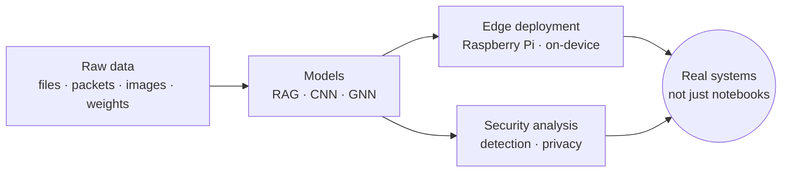

<div align="center">

```
██╗   ██╗██╗   ██╗ ██████╗     ██████╗  ██████╗ ██╗  ██╗ █████╗ ██████╗ ██╗ █████╗
╚██╗ ██╔╝██║   ██║██╔════╝     ██╔══██╗██╔═══██╗██║ ██╔╝██╔══██╗██╔══██╗██║██╔══██╗
 ╚████╔╝ ██║   ██║██║  ███╗    ██████╔╝██║   ██║█████╔╝ ███████║██║  ██║██║███████║
  ╚██╔╝  ██║   ██║██║   ██║    ██╔══██╗██║   ██║██╔═██╗ ██╔══██║██║  ██║██║██╔══██║
   ██║   ╚██████╔╝╚██████╔╝    ██║  ██║╚██████╔╝██║  ██╗██║  ██║██████╔╝██║██║  ██║
   ╚═╝    ╚═════╝  ╚═════╝     ╚═╝  ╚═╝ ╚═════╝ ╚═╝  ╚═╝╚═╝  ╚═╝╚═════╝ ╚═╝╚═╝  ╚═╝
```

**AI/ML Engineer · RAG · LLMs · Security Systems**

*I build ML systems that run where the data lives, and I care about shipping them, not just training them.*

[LinkedIn](https://www.linkedin.com/in/yug-rokadia/) · [Email](mailto:yug.rokadia@gmail.com) · [GitHub](https://github.com/YugRokadia)

</div>

---

```console
guest@yug:~$ whoami
Yug Rokadia

guest@yug:~$ cat profile.yml
role:       AI/ML Engineer
education:  B.E. Computer Engineering, NMIMS MPSTME, Mumbai
currently:  Information Security Intern @ RXIL
focus:      [RAG, LLMs, Computer Vision, Secure Data Infrastructure]
published:  Wiley
open_to:    [ML/AI internships, security + ML research]

guest@yug:~$ ./hire --check
[✔] ships ML to real hardware
[✔] understands both attacking and defending ML systems
[✔] published research
[✔] writes C++ and Python
=> strong match. say hi: yug.rokadia@gmail.com
```

> [!NOTE]
> Fun fact: I deploy ML models on Raspberry Pis more than I probably should.

---

## 🚀 What I Build



## 🧪 Featured Projects

| | Project | What it does | Result |
|---|---|---|---|
| 🐟 | **[Goldfish Search](https://github.com/YugRokadia/goldfish-search)** | Local, Spotlight-style semantic file search. Embeddings + LLM-powered RAG turn natural-language queries into on-device lookups. Nothing leaves your machine. | Fully local RAG |
| 🛡️ | **[GAT Payload Detection](https://github.com/YugRokadia/GAT-Based-Steganographic-Payload-Detection-in-Neural-Networks)** | Detects steganographic payloads hidden inside neural network weights using a graph attention network. 60+ CNNs trained, 22 byte-level features engineered. | **97% accuracy** |
| 📡 | **[TUI Packet Sniffer](https://github.com/YugRokadia/Packet-Sniffer)** | C++/libpcap capture engine feeding a Python terminal dashboard. Runs on a Raspberry Pi 4B acting as a router. | **17 protocols**, live |
| 🎭 | **[Emotion & Face Analysis](https://github.com/YugRokadia/Emotion-and-Face-Analysis-CNN)** | Dual-CNN pipeline for emotion plus age/race/gender estimation, with automatic face-blurring for privacy. Deployed on a Pi smart camera. | **80%+ accuracy** |

<details>
<summary><b>Stack per project</b></summary>

| Project | Tech |
|---|---|
| Goldfish Search | `Python` `LLMs` `RAG` `Embeddings` |
| GAT Payload Detection | `Python` `PyTorch` `GNN` `CNN` |
| TUI Packet Sniffer | `C++` `libpcap` `Python` `Linux` |
| Emotion & Face Analysis | `Python` `CNN` `Computer Vision` `Federated Learning` |

</details>

---

## ⚡ Tech Stack

| Area | Tools |
|---|---|
| **Languages** | `Python` `C++` `C` `Java` `JavaScript` `Rust` |
| **ML / AI** | `PyTorch` `TensorFlow` `scikit-learn` `CNNs` `GNNs` `GRUs` `LLMs` `RAG` `Vector Search` |
| **Backend & Data** | `Flask` `PostgreSQL` |
| **Infra & Tools** | `Docker` `Linux` `Git` `Raspberry Pi` |

## 🌱 Currently Exploring

```diff
+ AI x Security      adversarial robustness, model-weight forensics, secure ML pipelines
+ Edge AI            LLMs and vision models on Raspberry Pi-class hardware
+ Retrieval          hybrid, graph-based and agentic RAG beyond flat vector search
```

## 📝 Research

> **Cryptographic Overwrite-based Secure Data Deletion for Heterogeneous Storage Devices**
> Published in Wiley.

## 🏆 Highlights

| | |
|---|---|
| 🥇 | **Smart India Hackathon 2024**: Internal Hackathon Winner |
| 👥 | **Team Lead**, Hyphen Ideathon 2024 (Google Developer's Student Club) |
| 📚 | **Head of R&D**, Social Conclave 2025: study guides used by 700+ participants |
| 🏅 | Award winner at 5+ Model United Nations conferences |

---

<div align="center">

### Let's build something

📫 **[yug.rokadia@gmail.com](mailto:yug.rokadia@gmail.com)** · [LinkedIn](https://www.linkedin.com/in/yug-rokadia/)

</div>
